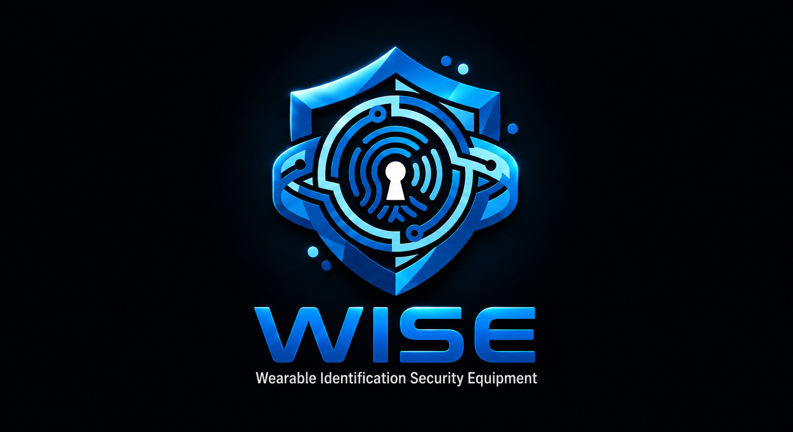
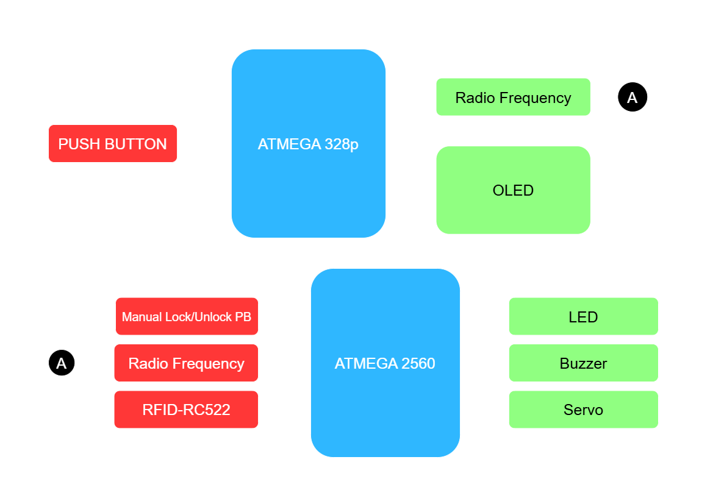
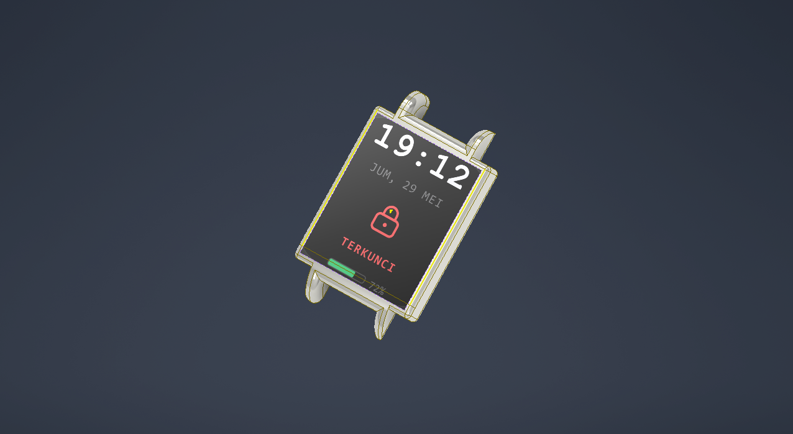

# WISE

  

### Wearable Intelligent Security Entry

---

## 📖 Deskripsi Proyek

WISE merupakan sistem wearable secure access berbasis AVR yang dirancang untuk mengurangi risiko relay attack pada sistem keyless entry konvensional.

Sistem menggunakan mekanisme transmit-on-demand, sehingga sinyal wireless hanya aktif saat tombol ditekan.

---

## 🎯 Tujuan Proyek

- Mengurangi risiko relay attack
- Mengurangi risiko kehilangan remote kendaraan
- Mengembangkan wearable embedded system berbasis AVR

---

## ⚙️ Fitur Utama

- Wearable-based access system
- Single button multi-command interface
- OLED status display
- Temporary RF transmission
- Magnetic charging dock
- Wireless authentication system

---

## 🔄 Cara Kerja Sistem

1. Wearable berada pada mode sleep untuk menghemat daya.
2. Pengguna menekan tombol pada wearable.
3. OLED aktif dan menampilkan status sistem.
4. Wearable mengirim sinyal RF ke receiver.
5. Receiver melakukan validasi autentikasi.
6. Sistem menjalankan perintah lock/unlock.
7. Wearable kembali ke mode sleep.

---

## 🔧 Komponen Hardware

| Komponen | Fungsi |
|---|---|
| ATmega328P | Wearable controller |
| Arduino Mega 2560 | Receiver controller |
| nRF24L01 | Wireless communication |
| OLED Display | User interface |
| Push Button | Input control |
| LiPo Battery | Power source |
| Magnetic Pogo Pin | Charging connector |
| Relay/Solenoid | Lock mechanism |

---

## 🧭 Visualisasi Sistem

### 📊 Blok Diagram

### 🌊 Flowchart

### 🧱 Desain Hardware

### 🧩 Desain 3D

### 📱 GUI Monitoring

---

## 👥 Tim Pengembang

| Nama | NRP | Divisi |
|---|---|---|
| Nicholas Miftahudin IB | 2124600019 | Project Manager |
| Susanto Angga Adi P. | 2124600022 | Software Engineer |
| Aditya Triyoga H. | 2124600030 | Hardware Engineer |
| Trimuna Tsuroya | 2125640037 | 3D Designer |
| M. Sagara Putra R. | 2124600025 | UI/UX Designer |
| Nauval Putra H. | 2124600009 | UI/UX Designer |

---

## 🚀 Future Development

- Mobile application integration
- Encrypted wireless communication
- Battery optimization system
- BLE communication support
- Real-time vehicle monitoring
- Multi-device authentication
- Compact custom PCB development
- Waterproof wearable casing
